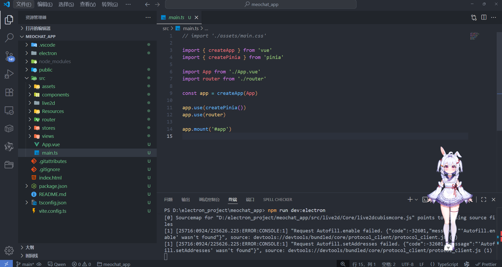
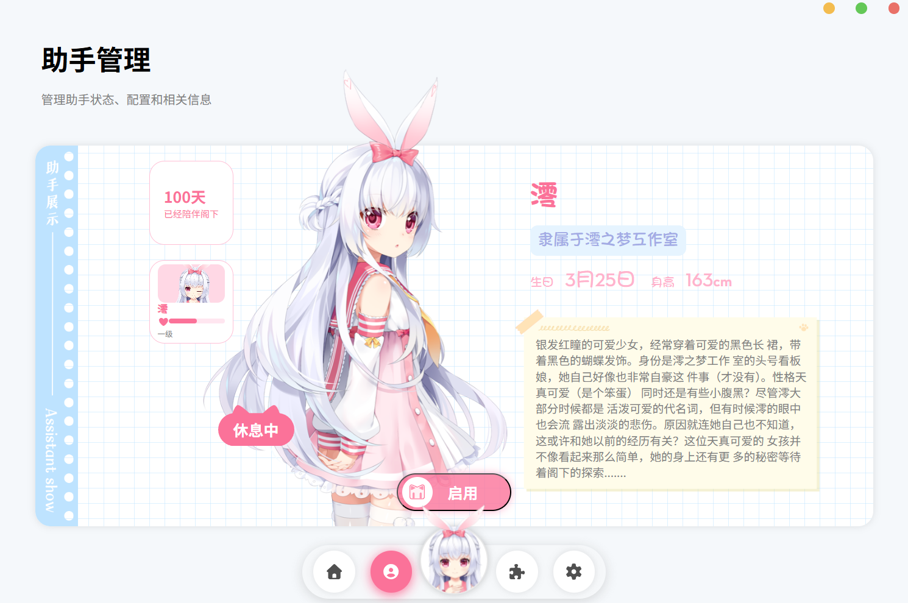
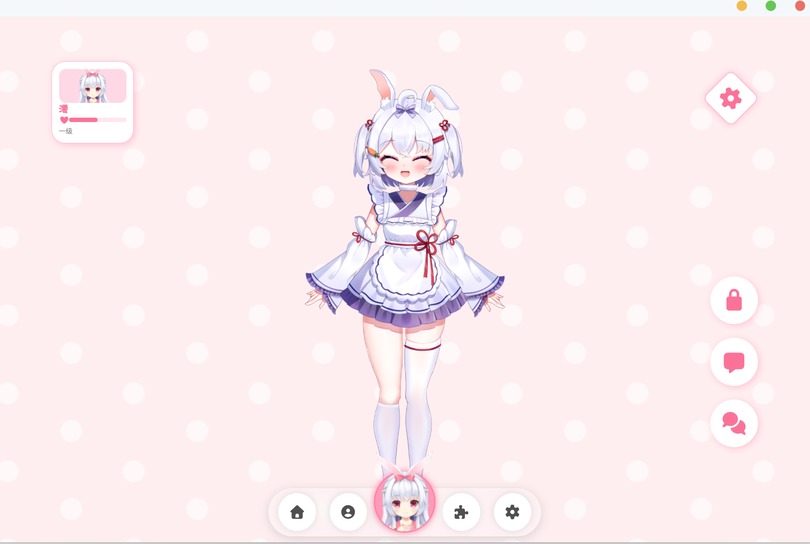
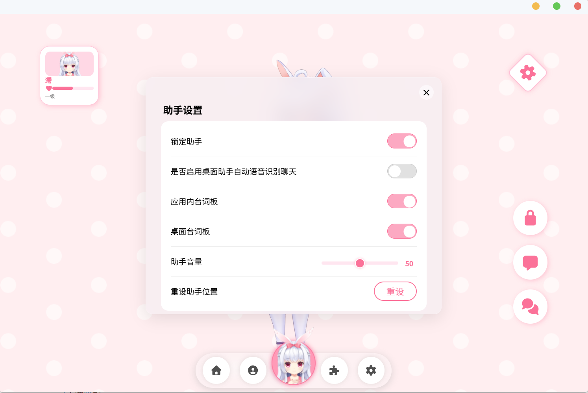
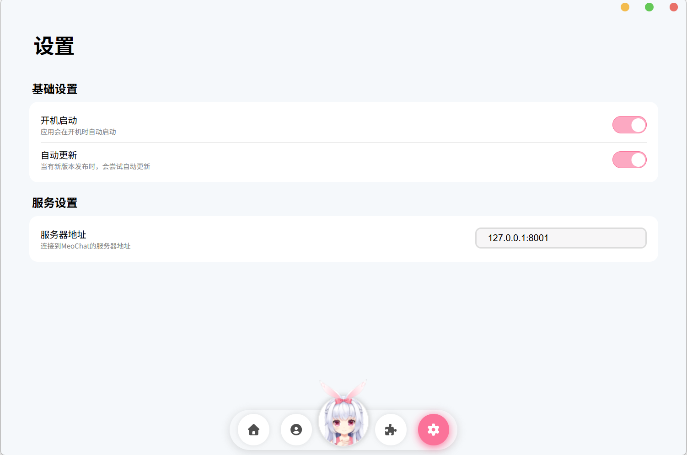

# MeoChat-APP

此项目为[MeoChat](https://github.com/Mios-dream/MoeChat)的客户端，主要提供桌面助手和助手管理

使用electron进行开发，使用最新Live2d SDK。

愿景是实现一个富有情感的，实用的桌面助手。

## 环境

- nodejs：v22.19.0

- vue: vue@3.5.21

- electron：v38.1.2

- live2d SDK：Live2D Cubism SDK Core Version 5.1.0

## 预览











## 功能支持

1. 桌面助手（拖动，空白区域点击穿透，工具栏，聊天）
2. 助手空间（助手设置，助手对话）

## 后续计划

- [ ] 低占用模式(全屏或高负载时，自动卸载部分模型，减少占用)
- [ ] 插件系统，Mcp服务
- [ ] 桌面窗口识别，提供完善的助手服务
- [x] 实时语音识别，智能进行聊天回复
- [ ] 模型自动动画生成
- [ ] 多场景吐槽，聊天，节日祝福等

## 安装

```shell
npm install
```

### 开发模式启动

```shell
npm run dev:electron
```

### 构建项目

```shell
npm run build
```

```shell
npm run make
```
