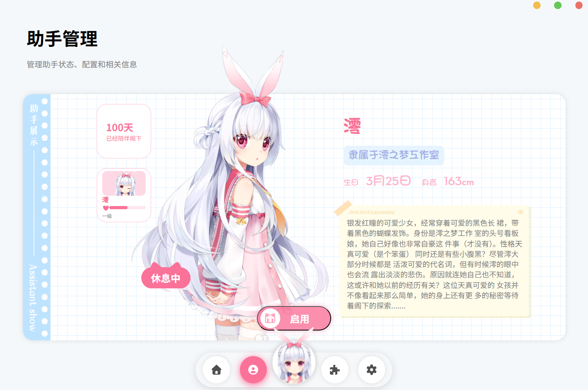
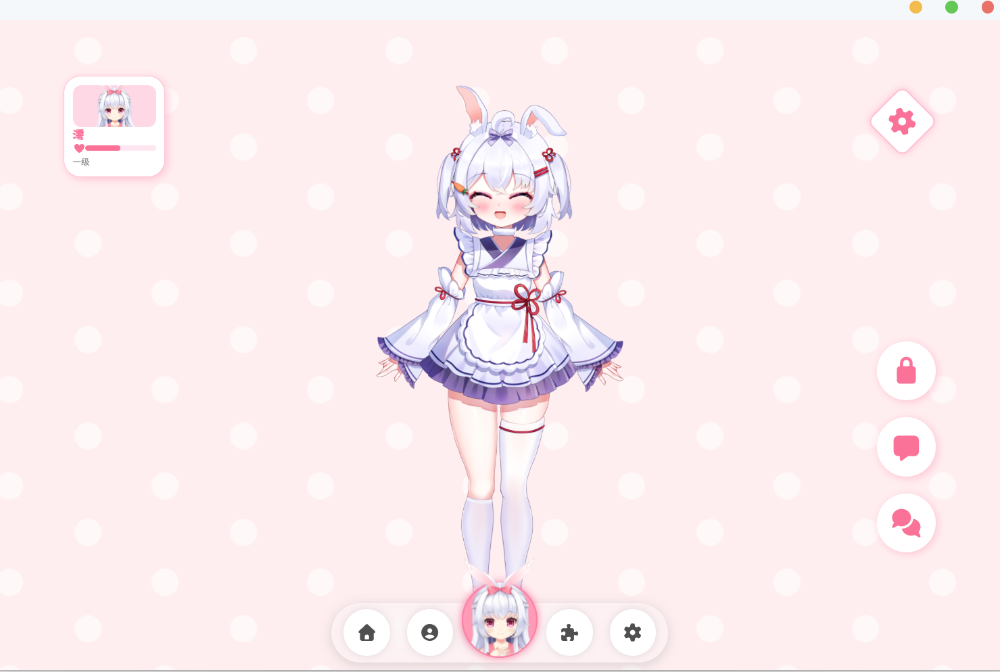
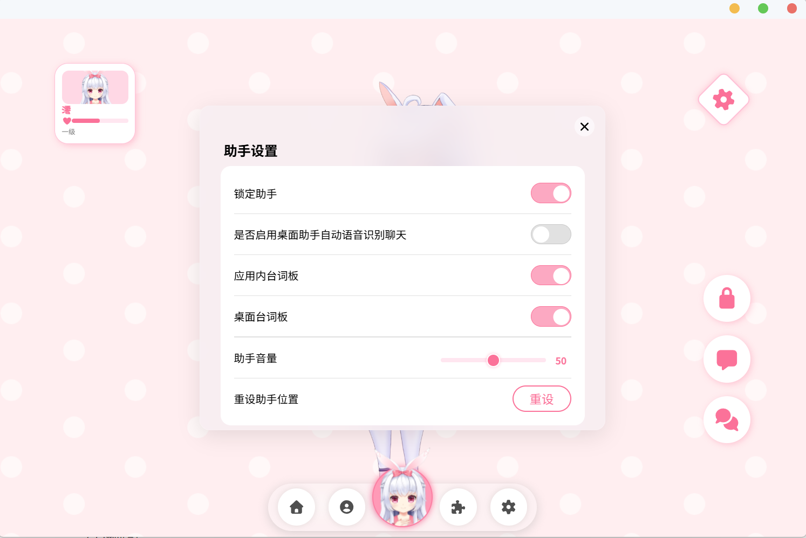
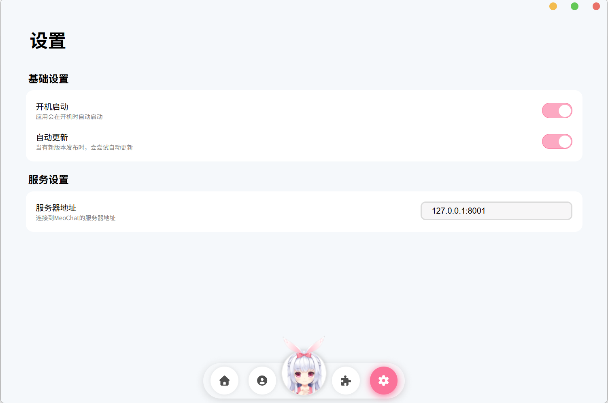

# 🌸 MoeChat-APP


<p align="center">
  <span>一个现代化、功能丰富的桌面助手客户端</span>
  <br/>
  <span>基于 Electron 和 Vue 3 构建，集成 Live2D 看板娘和智能对话系统</span>
</p>

<p align="center">
  <a href="https://nodejs.org/">= 22" src="https://img.shields.io/badge/node.js-%3E%3D22-brightgreen?style=flat-square"></a>
  <a href="https://vuejs.org/"></a>
  <a href="https://www.electronjs.org/"></a>
  <a href="https://www.live2d.com/"></a>
  <a href="./LICENSE"></a>
</p>

<p align="center">
  <a href="#-项目简介">项目简介</a> • 
  <a href="#-核心特性">核心特性</a> • 
  <a href="#-快速开始">快速开始</a> • 
  <a href="#-项目结构">项目结构</a> • 
  <a href="#⚡-可用命令">命令</a> • 
  <a href="#-开发路线">开发路线</a>
</p>

---

## 📋 项目简介

**MoeChat-APP** 是 [MoeChat](https://github.com/Mios-dream/MoeChat) 项目的官方桌面客户端。这是一个富有情感、实用且可爱的AI桌面助手，旨在为用户提供一个智能、交互式的桌面伴侣。

### 🎯 项目愿景

实现一个集**颜值、情感、实用**为一体的桌面助手：

- 🎨 精美的 Live2D 看板娘动画效果
- 💬 自然流畅的对话交互体验
- 🚀 高效的资源占用管理
- 🎤 智能的语音识别和合成
- 🌈 丰富的交互场景和功能

## ✨ 核心特性

### 🎭 桌面助手功能

- **拖动定位** - 自由拖动助手窗口到屏幕任意位置
- **点击穿透** - 空白区域支持鼠标穿透，不影响后台操作
- **工具栏** - 快速访问常用功能的浮动工具栏
- **实时聊天** - 与AI助手进行自然流畅的对话
- **Live2D 动画** - 高保真的看板娘动画表现

### 🎛️ 助手管理

- **助手空间** - 管理和配置多个AI助手的专属空间
- **助手设置** - 自定义助手的性格、声音、动作等参数
- **对话管理** - 查看和管理与各助手的对话历史

### 🧠 智能功能

- **实时语音识别** - 支持自然语音输入，智能识别用户意图
- **模型动画生成** - 根据对话内容自动生成对应的表情和动作
- **多场景响应** - 支持吐槽、问候、祝福等多种交互场景

### ⚡ 性能优化

- **低占用模式** - 全屏或高负载时自动卸载部分模型，降低系统占用
- **智能内存管理** - 动态调整资源占用策略

## 🎨 项目截图

<table>
  <tr>
    <td></td>
    <td></td>
  </tr>
  <tr>
    <td></td>
    <td></td>
  </tr>
</table>


### 🎞️ 演示视频

当前只演示了软件内聊天，展示表情和语音

https://github.com/user-attachments/assets/3878b0fc-fefb-49b6-b987-5f663cce9b48


## 🚀 快速开始

### 📦 环境要求

| 软件     | 版本      | 说明                |
| -------- | --------- | ------------------- |
| Node.js  | ≥ 22.19.0 | JavaScript 运行环境 |
| npm/yarn | 最新      | 包管理工具          |
| 操作系统 | Windows / Linux | Windows 在本机构建；Linux 版需在 Linux 或 WSL2 环境构建（原生模块与 AppImage/deb 工具链仅在 Linux 可用） |

### 💻 安装与运行

#### 对于普通用户

> 推荐使用完整整合包
>
> MoeChat
> 链接: https://pan.baidu.com/s/5h_xqAGOZWkn4Y5dMSXk4Vg

#### 如果你希望从源码开始：

1. **克隆仓库**

   ```bash
   git clone https://github.com/Mios-dream/MoeChat-APP.git
   cd MoeChat-APP
   ```

2. **安装依赖**

   ```bash
   npm install
   ```

3. **开发模式启动**

   ```bash
   npm run dev
   ```

   应用将在编译完成后自动启动

4. **构建应用**

   ```bash
   # 通用编译（typecheck + electron-vite build）
   npm run build

   # ── Windows ─────────────────────────────────────────────
   # 一键构建全部三个变体（lite / cpu / cuda），直接运行 PowerShell 脚本
   .\scripts\build-all.ps1 -KernelSource D:\python\MoeChat\dist

   # 只构建指定变体（跳过其余）：可自由组合 -Lite / -Cpu / -Cuda
   .\scripts\build-all.ps1 -KernelSource D:\python\MoeChat\dist -Cpu -Cuda

   # 单独构建某个变体（需要先 prepare-kernel-assets.ps1）
   npm run build:win         # 精简版 lite：NSIS 安装包
   npm run build:win:cpu     # cpu 版：zip（离线可用）
   npm run build:win:cuda    # cuda 版：zip（离线可用）

   # ── Linux ──────────────────────────────────────────────
   # 需在 Linux（或 WSL2）执行：原生模块（node-pty/robotjs/uiohook 等）按平台编译，
   # AppImage/deb 工具链也仅在 Linux 可用
   pwsh ./scripts/build-all-linux.ps1 -KernelSource D:\python\MoeChat\dist

   # 只构建指定变体
   pwsh ./scripts/build-all-linux.ps1 -KernelSource D:\python\MoeChat\dist -Cpu -Cuda

   # 单独构建某个变体
   npm run build:linux         # Linux lite：AppImage + deb
   npm run build:linux:cpu     # Linux cpu 版：zip（离线可用）
   npm run build:linux:cuda    # Linux cuda 版：zip（离线可用）
   ```

   说明：`build-all.ps1` / `build-all-linux.ps1` 省略 `-KernelSource` 时 PowerShell 会交互式
   提示输入；省略全部变体开关时默认构建三个变体。

   三种变体说明：

   - **lite（精简版）**：仅含内核源码资产包，依赖与模型首次运行在线安装；Windows 为 NSIS 安装包，Linux 为 AppImage + deb，体积 < 2GB。
   - **cpu（完整版 CPU）**：CPU wheels + 数据包，离线开箱即用，zip 压缩包（含数据后体积 > 2GB，超出 NSIS/AppImage 上限）。
   - **cuda（完整版 CUDA）**：CUDA 12.13 wheels + 数据包，离线开箱即用，zip 压缩包。

   资产包与数据包命名（由后端 `build-asset-bundle.ps1` / `build-data-bundle.ps1` 产出，
   `scripts/prepare-kernel-assets.ps1` 按平台/变体挑选拷贝到 `resources/kernel-assets`）：
   - 资产包（区分平台 + 变体）：`moechat-assets-v{ver}-{win|linux}-{lite|cpu|cu130}.zip`
   - 数据包（平台/变体无关的通用数据）：`moechat-data-v{ver}.zip`
   - lite 变体仅含资产包；cpu/cuda 变体 = 对应资产包 + 数据包

   Linux 构建前置要求：
   - 后端需产出 Linux 资产包：`build-asset-bundle.ps1 -Platform linux`（在 Windows 上亦可执行，仅下载 manylinux 轮子）
   - 准备 Linux 版 uv：`scripts\build-python-runtime.ps1 -Platform linux`
   - 目标发行版需 glibc ≥ 2.28（Ubuntu 18.04+ / Debian 10+），torch 2.7+ 仅发布 manylinux_2_28 轮子

## 📂 项目结构

```
MoeChat-APP/
├── src/
│   ├── main/                    # 主进程代码
│   │   ├── config/              # 应用配置管理
│   │   ├── ipc/                 # 进程间通信处理
│   │   ├── permission/          # 权限管理
│   │   ├── protocol/            # 自定义协议
│   │   ├── services/            # 核心服务模块
│   │   ├── tray/                # 系统托盘功能
│   │   ├── utils/               # 工具函数
│   │   ├── windows/             # 窗口管理
│   │   └── main.ts              # 主进程入口
│   ├── preload/                 # 预加载脚本
│   │   ├── types/               # TypeScript 类型定义
│   │   └── *Preload.ts          # 各窗口预加载脚本
│   └── renderer/                # 渲染进程 (Vue 3)
│       ├── src/
│       │   ├── components/      # Vue 组件
│       │   ├── views/           # 页面视图
│       │   ├── stores/          # 状态管理 (Pinia)
│       │   ├── services/        # 业务逻辑服务
│       │   ├── types/           # 类型定义
│       │   ├── utils/           # 工具函数
│       │   └── App.vue          # 根组件
│       └── public/              # 静态资源
│           └── images/          # 图片资源
├── build/                       # 构建配置
├── resources/                   # 应用资源
├── electron.vite.config.ts      # Electron 构建配置
├── tsconfig.json                # TypeScript 配置
├── eslint.config.mjs            # ESLint 配置
└── README.md                    # 项目说明文档
```

## 🎯 开发路线

### ✅ 已完成功能

- [x] 桌面助手基础框架
- [x] Live2D 看板娘集成
- [x] 实时语音识别和合成
- [x] 模型自动动画生成
- [x] 低占用模式优化
- [x] 多场景吐槽、对话、祝福系统
- [x] 助手管理和配置系统

### 🔄 开发中功能

- [ ] 插件系统
- [ ] 澪酱陪你看番剧
- [ ] 更丰富的动画

### 📋 计划功能

- [ ] 桌面窗口识别，提供 Context-aware 的助手服务
- [ ] 详细的助手配置

## 🛠 技术栈

- **框架**: Electron 38 + Vue 3 + TypeScript
- **状态管理**: Pinia
- **动画库**: Live2D Cubism SDK 5.1.0
- **音频处理**: Web Audio API
- **构建工具**: Electron Vite

## 💡 开发指南

### 代码规范

- 使用 TypeScript 进行类型检查
- 遵循 ESLint 规则进行代码格式化
- 遵守 Prettier 的代码风格

### 主进程 vs 渲染进程

- **主进程** (`/src/main/`) - 系统级操作，窗口管理，文件 I/O
- **渲染进程** (`/src/renderer/`) - UI 展示，用户交互，数据处理

### IPC 通信

通过预加载脚本在主进程和渲染进程之间建立安全的通信桥梁

## 🤝 贡献

欢迎提交 Issue 和 Pull Request！

1. Fork 本仓库
2. 创建特性分支 (`git checkout -b feature/AmazingFeature`)
3. 提交更改 (`git commit -m 'Add some AmazingFeature'`)
4. 推送到分支 (`git push origin feature/AmazingFeature`)
5. 提交 Pull Request

## 📄 许可证

本项目采用 GPL 许可证 - 详见 [LICENSE](./LICENSE) 文件

## 🙏 致谢

- [Electron](https://www.electronjs.org/) - 跨平台桌面应用框架
- [Vue 3](https://vuejs.org/) - 渐进式 JavaScript 框架
- [Live2D](https://www.live2d.com/) - 实时卡通角色渲染技术
- [MoeChat](https://github.com/Mios-dream/MoeChat) - 原始后端项目

---

<p align="center">
  Made with ❤️ by <a href="https://github.com/Mios-dream">Mios-dream</a>
</p>

<p align="center">
  <a href="#-moeChat-app">⬆ 返回顶部</a>
</p>
